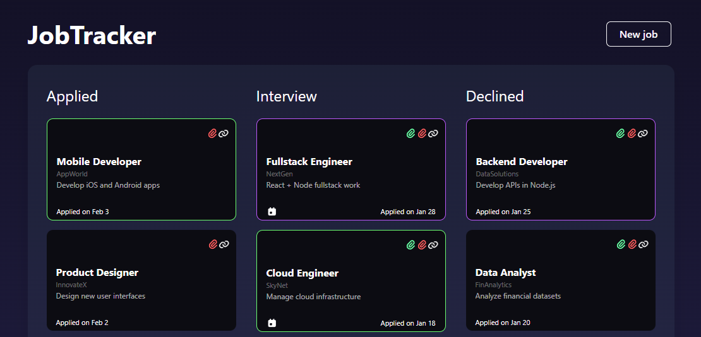

# JobTracker

A personal Applicant Tracking System (ATS) to manage job applications, documents, and follow-ups in one centralized dashboard.

## Tech Stack
* **Frontend:** React, TypeScript
* **Backend:** Node.js
* **Database:** PostgreSQL

## Key Features
* **Kanban Board:** Track applications by stage (Applied, Interview, Declined).
* **Document Management:** Link specific CVs and cover letters to each entry.
* **Follow-up Reminders:** Visual cues for pending follow-ups.

