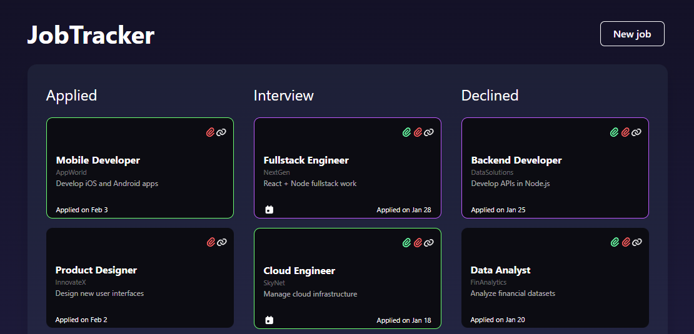

# JobTracker

A personal Applicant Tracking System (ATS) to manage job applications, documents, and follow-ups in one centralized dashboard.

## Demo



## Motivation

As an active job seeker, I wanted a tool more flexible than spreadsheets to organize applications, documents, and follow-ups efficiently. This project allowed me to build something practical while strengthening my full-stack development skills.

## Features

- **Kanban Board**: Visualize and track applications by stage (Applied, Interview, Offer, Declined).
- **Document Management**: Upload and link specific CVs and cover letters to each job entry.
- **Application Forms**: Easily add and edit job applications with detailed fields.
- **Calendar Integration**: View interview dates and deadlines.
- **File Uploads**: Securely store documents locally or via cloud services (Cloudinary integration).
- **Responsive Design**: Works seamlessly on desktop and mobile devices.
- **Real-time Updates**: Immediate reflection of changes in the dashboard.

## Tech Stack

- **Frontend**: React 19, TypeScript, Vite, CSS Modules, FontAwesome Icons
- **Backend**: Node.js, Express.js, Multer (file uploads)
- **Database**: PostgreSQL

## Prerequisites

- Node.js (v18 or higher)
- PostgreSQL
- npm or yarn

## Installation

1. **Clone the repository**:
   ```bash
   git clone https://github.com/yourusername/job-tracker.git
   cd job-tracker
   ```

2. **Set up the database**:
   - Install PostgreSQL and create a database.
   - Run the SQL scripts in the `db/` folder:
     ```bash
     psql -d your_database_name -f db/create_tables.sql
     psql -d your_database_name -f db/data_example.sql  # Optional: Load sample data
     ```

3. **Configure environment variables**:
   - Create a `.env` file in the `backend/` directory with:
     ```
     DB_HOST=localhost
     DB_PORT=5432
     DB_DATABASE=your_database_name
     DB_USER=your_username
     DB_PASSWORD=your_password

     ```

4. **Install dependencies**:
   - Backend:
     ```bash
     cd backend
     npm install
     ```
   - Frontend:
     ```bash
     cd frontend
     npm install
     ```

## Usage

1. **Start the backend server**:
   ```bash
   cd backend
   npm run dev  # For development with nodemon
   # or
   npm start    # For production
   ```
   The server will run on `http://localhost:3000`.

2. **Start the frontend**:
   ```bash
   cd frontend
   npm run dev
   ```
   Open `http://localhost:5173` in your browser.

3. **Access the application**:
   - Add new job applications via the form.
   - Drag and drop applications across the Kanban board to update status.
   - Upload CVs and cover letters directly to job entries.
   - View and edit details in the application panels.

## API Endpoints

- `GET /api` - Retrieve all job applications
- `POST /api/jobs` - Create a new job application
- `PUT /api/jobs/:id` - Update an existing job application
- `DELETE /api/delete/:id` - Delete a job application and associated files
- `POST /api/upsert-file` - Upload a file (CV or cover letter)

## Project Structure

```
job-tracker/
├── backend/          # Express.js server
│   ├── server.js     # Main server file
│   ├── package.json
│   └── uploads/      # Uploaded files directory
├── db/               # Database scripts
│   ├── create_tables.sql
│   ├── data_example.sql
│   └── applications.json
├── frontend/         # React application
│   ├── src/
│   │   ├── components/  # Reusable UI components
│   │   ├── hooks/       # Custom React hooks
│   │   ├── mappers/     # Data transformation
│   │   ├── styles/      # CSS variables and styles
│   │   └── types/       # TypeScript type definitions
│   ├── package.json
│   └── vite.config.js
├── doc/              # Documentation and demo images
└── README.md
```


